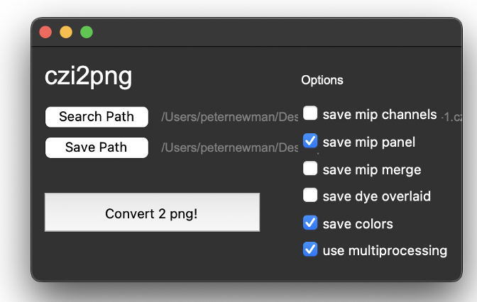

# czi2png

This wrapper GUI + script (around the aicslibczi library) for batch processing / converting your '.czi' files to '.png's

## Info

Written by: Pete, 2023, (peterlionelnewman @ gmail com / p.newman @ sydney edu au) Helpful for students I worked with

1. searches a folder for .czi files
2. exports a mip of each czi channel

## To run, use something something like:
```
    conda create -n czi2png python=3.10.6 pip
    conda activate czi2png
    pip install -r requirements.txt
    cd <path to czi2png>
    python czi2png.py 
```

- best ran from a conda venv
- see requirements.txt

## To use

1. Click and specify the search path button search fo czi's
2. Click and specify the saving path
3. Select options for png export
4. Click 'Converyt 2 png'!

i.e.:




## Notes

- Go check out the Allen Institue of Cell Science package !!!
- This exists because sometimes the AICS package is buggy with rounding errors. But otherwise we AOK.
